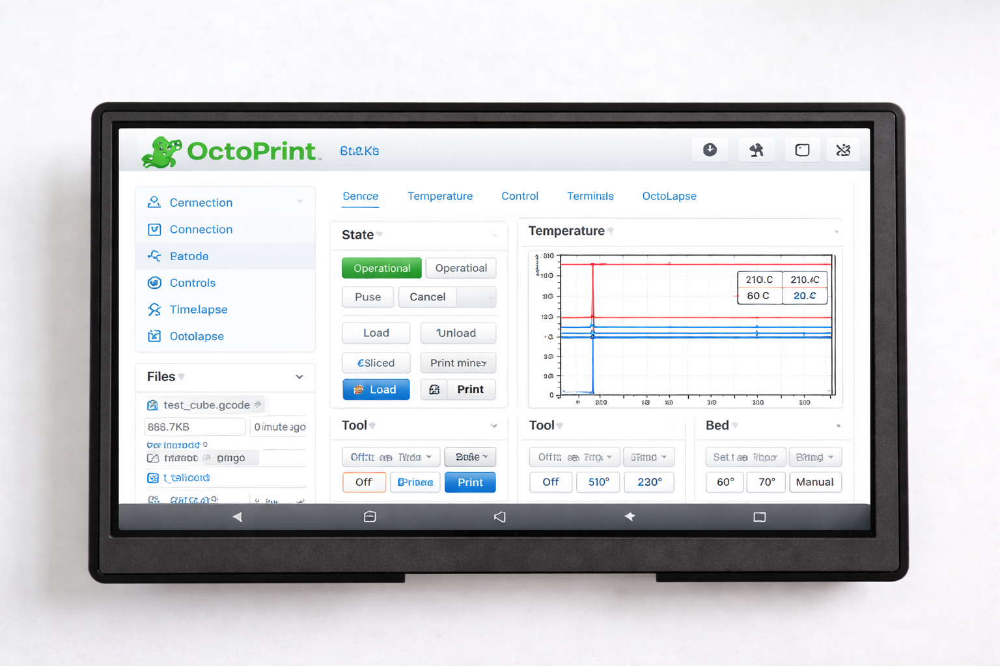
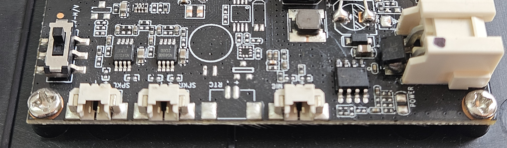
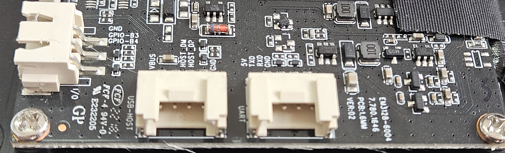

<p align="center">
  
</p>

<h1 align="center">7" Industrial Touch Panel — 3D Printer Dashboard</h1>

<p align="center">
  <b>Fanless · 24V DC / 5V USB Powered · Workshop Ready · USB Serial Built-in</b><br>
  <i>Dedicated control panel for OctoPrint, Klipper/Moonraker, and 3D printer management</i>
</p>

<p align="center">
  <a href="#key-features">Features</a> •
  <a href="#technical-specifications">Specs</a> •
  <a href="#io-and-connectivity">I/O</a> •
  <a href="#driver-support">Drivers</a> •
  <a href="#3d-printing-integration">3D Printing</a> •
  <a href="#mounting--installation">Mounting</a> •
  <a href="#gallery">Gallery</a>
</p>

---

## Overview

A ruggedized 7-inch industrial touch panel built around the **Rockchip RK3128** quad-core SoC, configured as a dedicated **3D printer control dashboard**. Ships with Mobileraker (Klipper/Moonraker), OctoRemote (OctoPrint), and Octo4a pre-installed — ready to monitor and control your printer out of the box.

Unlike repurposed phones or cheap tablets, this panel is engineered for **24/7 workshop operation**: passive cooling that won't overheat near your heated bed, 24V DC power from the same PSU as your printer, USB serial drivers for direct printer connections, and four mounting screws for permanent enclosure installation.

---

## Key Features

| | Feature | Details |
|:---:|---|---|
| 🏭 | **Workshop Grade** | Designed for continuous 24/7 operation next to printers, CNCs, and laser cutters |
| ❄️ | **Passive Cooling** | Fully fanless, zero moving parts — no vibration interference with prints |
| ⚡ | **Dual Power Input** | 24V DC 2-pin connector (share your printer's PSU) **or** 5V DC via Micro-USB |
| 🖥️ | **7" Multi-Touch Display** | 1024×600 IPS, 5-point capacitive touch, 160 DPI |
| 🖨️ | **3D Printer Ready** | Pre-installed Mobileraker, OctoRemote, Octo4a + OctoPrint web UI shortcut |
| 🔌 | **USB Serial Built-in** | FTDI, CH341, CP210x, PL2303 drivers — direct G-code serial link to printer boards |
| 🔩 | **Panel Mountable** | 4× M3 mounting screws for enclosure or shelf mounting |
| 📡 | **Wireless** | WiFi 802.11 b/g/n (2.4 GHz) |
| 🔧 | **Fully Hackable** | Rooted Android 7.1.2 with unlocked bootloader, full ADB access, custom kernel modules |

---

## Technical Specifications

### Processor & Memory

| Specification | Value |
|---|---|
| **SoC** | Rockchip RK3128 |
| **CPU** | Quad-core ARM Cortex-A7 @ 1.2 GHz |
| **GPU** | ARM Mali-400 MP (OpenGL ES 2.0) |
| **RAM** | 1 GB DDR3 |
| **Storage** | 8 GB eMMC (~3.6 GB available for user data) |

### Display

| Specification | Value |
|---|---|
| **Size** | 7 inches (diagonal) |
| **Resolution** | 1024 × 600 pixels |
| **Type** | IPS LCD |
| **Touch** | 5-point capacitive multi-touch |
| **Density** | 160 DPI |
| **Refresh Rate** | 57 Hz |
| **Brightness** | Software adjustable |

### Power Supply

| Specification | Value |
|---|---|
| **Primary Input** | **24V DC** via 2-pin connector (share your printer's PSU) |
| **Alternative Input** | **5V DC** via Micro-USB connector |
| **Power Consumption** | < 5W typical |
| **Battery** | Internal Li-ion backup (maintains operation during power transitions) |
| **Operating Mode** | Continuous 24/7 operation |

### Physical

| Specification | Value |
|---|---|
| **Cooling** | Fully passive (fanless) — no moving parts, no vibration |
| **Mounting** | 4× screw holes for panel/enclosure mount |
| **Operating Temperature** | 0°C to +50°C |
| **Enclosure** | Rugged ABS/polycarbonate housing |

### Included Accessories

| Item | Description |
|---|---|
| **24V DC cable with connector** | Pre-wired cable with matching 2-pin connector, ready to connect to your printer's PSU |
| **Power button** | External power button for convenient on/off control |
| **WiFi antenna** | External WiFi antenna for improved signal reception |
| **Mounting screws** | 4× screws for enclosure/shelf installation |

### Software

| Specification | Value |
|---|---|
| **OS** | Android 7.1.2 (Nougat) |
| **Build** | Rooted userdebug with full ADB access |
| **Kernel** | Linux 3.10.104 (with custom module support) |
| **WebView** | Chrome 119 (upgraded from AOSP default) |
| **Mobileraker** | Klipper/Moonraker dashboard — pre-installed |
| **OctoRemote** | OctoPrint remote control — pre-installed |
| **Octo4a** | OctoPrint server on tablet — pre-installed |
| **OctoPrint Web UI** | Chrome shortcut to your OctoPrint server |

---

## I/O and Connectivity

### Port Diagram

```
┌────────────────────────────────────────────────────────────┐
│                        FRONT PANEL                         │
│                     7" Touch Display                       │
│                     1024 × 600 px                          │
│                                                            │
│  [ Front Camera ]                 [ Ambient Light Sensor ] │
└────────────────────────────────────────────────────────────┘

┌────────────────────────────────────────────────────────────┐
│                       SIDE / REAR I/O                      │
│                                                            │
│  ┌──────────────┐  ┌──────────────┐  ┌─────────────────┐  │
│  │  Micro-USB   │  │  USB OTG     │  │  2× USB Host    │  │
│  │  OTG + Power │  │  (4-pin hdr) │  │  (4-pin headers)│  │
│  └──────────────┘  └──────────────┘  └─────────────────┘  │
│                                                            │
│  ┌──────────────┐  ┌──────────────┐  ┌─────────────────┐  │
│  │  24V DC      │  │  Speaker     │  │  Microphone     │  │
│  │  (2-pin)     │  │  Header      │  │  Connector      │  │
│  └──────────────┘  └──────────────┘  └─────────────────┘  │
│                                                            │
│  ┌──────────────┐  ┌──────────────┐  ┌─────────────────┐  │
│  │  Serial Port │  │  Serial Port │  │  2× GPIO Pins   │  │
│  │  UART0 (TTL) │  │  UART1 (TTL) │  │  (3.3V logic)   │  │
│  └──────────────┘  └──────────────┘  └─────────────────┘  │
│                                                            │
│               [ 4× Mounting Screw Holes ]                  │
└────────────────────────────────────────────────────────────┘
```

### Connector Summary

| Connector | Count | Description |
|---|:---:|---|
| **Micro-USB OTG** | 1 | USB On-The-Go port — doubles as 5V power input |
| **USB OTG (pin header)** | 1 | 4-pin connector for second USB OTG interface |
| **USB Host (pin header)** | 2 | 4-pin connectors for USB 2.0 host — connect serial adapters, webcams, WiFi dongles |
| **Serial Ports (UART)** | 2 | Hardware UART0 & UART1 — 3.3V TTL. Direct connection to printer boards, CNC controllers |
| **GPIO Pins** | 2 | General Purpose I/O — 3.3V logic, controllable from userspace |
| **24V DC Input** | 1 | 2-pin power connector for 24V DC supply |
| **Speaker Connector** | 1 | Header for external speaker — print completion alerts |
| **Microphone Connector** | 1 | Pin header for external microphone |
| **MicroSD Slot** | 1 | Expandable storage (up to 64 GB) — G-code file storage |

### Wireless

| Interface | Details |
|---|---|
| **WiFi** | 802.11 b/g/n — 2.4 GHz, up to 72 Mbps |
| **WiFi Direct** | Peer-to-peer connections supported |

### Sensors

| Sensor | Model | Use Case |
|---|---|---|
| **Accelerometer** | MMA8451Q | Screen auto-rotation, vibration detection |

---

## Driver Support

The tablet ships with **pre-compiled kernel modules** for a wide range of USB peripherals. All modules are cross-compiled for the RK3128 platform (Linux 3.10.104, ARMv7) and auto-loaded at boot.

### USB Serial Adapters

Plug-and-play support for all major USB-to-serial chipsets — essential for direct printer communication:

| Chipset | Module | Typical Use |
|---|---|---|
| **FTDI FT232 / FT2232** | `ftdi_sio.ko` | Industry-standard serial adapters, 3D printer boards |
| **CH340 / CH341** | `ch341.ko` | Arduino-based printer boards (RAMPS, MKS, SKR) |
| **CP2102 / CP2104** | `cp210x.ko` | Prusa, Duet, and other premium boards |
| **PL2303** | `pl2303.ko` | Legacy serial adapters |

### USB WiFi Dongles

Extend or replace built-in WiFi:

| Chipset | Module |
|---|---|
| Realtek RTL8188EU | `8188eu.ko` |
| Realtek RTL8192CU | `8192cu.ko` |
| Realtek RTL8192DU | `8192du.ko` |
| Realtek RTL8723AU | `8723au.ko` |
| Realtek RTL8723BS | `8723bs.ko` |
| Realtek RTL8723BU | `8723bu.ko` |
| Realtek RTL8812AU | `8812au.ko` |
| Realtek RTL8188FU | `8188fu.ko` |
| Realtek RTL8822BU | `8822bu.ko` |

### USB Bluetooth Dongles

| Module | Supported Chipsets |
|---|---|
| `btusb.ko` | Generic USB Bluetooth (CSR, Intel, Broadcom, Realtek) |
| `ath3k.ko` | Atheros AR3011/AR3012 |
| `btbcm203x.ko` | Broadcom BCM203x |

> **All modules are pre-installed.** Just plug in your USB device and it works.

---

## 3D Printing Integration

### Pre-Installed Apps

Every panel ships ready for 3D printer control:

| App | Package | Purpose |
|---|---|---|
| **Octo4a** | `com.octo4a` | Run OctoPrint server directly **on the tablet** — no Raspberry Pi needed |
| **Mobileraker** | `com.mobileraker.android` | Native Klipper/Moonraker dashboard with real-time monitoring |
| **OctoRemote** | `com.kabacon.octoremote` | OctoPrint remote control with webcam view |
| **OctoPrint Web UI** | Chrome shortcut | Full OctoPrint interface via Chrome 119 |

### What's Pre-Configured

- ✅ **Auto-start on boot** — your printer dashboard launches automatically
- ✅ **Chrome 119 WebView** — modern web rendering for OctoPrint/Mainsail/Fluidd
- ✅ **USB serial drivers** — FTDI, CH341, CP210x, PL2303 for direct printer connection
- ✅ **Kiosk mode** — screen stays on, no sleep, navigation hidden
- ✅ **WiFi pre-configured** — connects to your workshop network immediately
- ✅ **Bloatware removed** — maximum RAM available for printer apps

### Use Cases

| Application | How |
|---|---|
| **Klipper Dashboard** | Mobileraker connects to your Raspberry Pi running Klipper + Moonraker |
| **OctoPrint Remote** | OctoRemote or Chrome to your OctoPrint server for full print control |
| **OctoPrint Server** | Octo4a runs OctoPrint directly on the tablet — connect printer via USB serial |
| **Mainsail / Fluidd** | Chrome 119 shortcut to your Klipper web UI |
| **Multi-Printer Monitor** | Open multiple browser tabs for different printer instances |
| **G-code Sender** | Direct serial connection to Marlin/GRBL via hardware UART or USB adapter |
| **Print Farm Display** | Wall-mount as a centralized status board for multiple printers |
| **CNC Controller** | Serial to GRBL/LinuxCNC + real-time toolpath visualization |

### Serial Connection to Printer

#### Option A: USB Serial Adapter

1. Plug a USB-to-serial adapter (CH341 or FTDI recommended) into a USB Host pin header
2. Connect the adapter to your printer board's serial port
3. The driver loads automatically — device appears as `/dev/ttyUSB0`
4. Point Octo4a or OctoPrint to `/dev/ttyUSB0`

#### Option B: Direct UART (3.3V TTL)

1. Wire UART0 (`/dev/ttyS0`) directly to your printer board's serial pins
2. Connect: Tablet TX → Board RX, Tablet RX → Board TX, GND → GND
3. **Important:** Signals are 3.3V TTL — use a level shifter if your board requires 5V

### Webcam for Print Monitoring

Connect a USB webcam to a USB Host pin header for live print monitoring through OctoPrint or Octo4a. Most UVC-compatible webcams are supported out of the box.

---

## Mounting & Installation

### Printer Enclosure Mount

Four M3 threaded mounting holes on the rear panel:

- **Enclosure mount** — screw directly to your printer enclosure panel
- **Shelf mount** — attach to a shelf above or beside your printer
- **Wall mount** — direct screw-in near your printer station

### Power Wiring

```
Option A — Shared PSU (recommended)
┌──────────┐      ┌─────────┐      ┌──────────┐
│  24V DC  │─────▶│ 2-pin   │─────▶│  Tablet  │
│  PSU     │      │ connector│      │          │
└──────────┘      └─────────┘      └──────────┘
  Same 24V PSU as your 3D printer

Option B — USB Power
┌──────────┐      ┌─────────┐      ┌──────────┐
│  5V USB  │─────▶│ Micro   │─────▶│  Tablet  │
│  Adapter │      │ USB     │      │          │
└──────────┘      └─────────┘      └──────────┘
  Any quality 5V/2A charger
```

---

## Gallery

### Hardware

<p align="center">
  &nbsp;&nbsp;
  
</p>
<p align="center">
  &nbsp;&nbsp;
  
</p>
<p align="center">
  &nbsp;&nbsp;
  
</p>
<p align="center">
  &nbsp;&nbsp;
  
</p>

---

## Documentation

| Document | Description |
|---|---|
| [Technical Specifications](docs/SPECIFICATIONS.md) | Full hardware & software spec sheet |
| [Driver & Module Guide](docs/DRIVERS.md) | Supported USB peripherals and kernel modules |
| [Getting Started](docs/GETTING_STARTED.md) | Setup and configuration walkthrough |

---

## Customization

Need something beyond the standard configuration? We can provide:

- **Additional kernel drivers** — support for specific USB devices, webcams, or communication protocols
- **Custom Klipper screen UI** — tailored dashboards for your specific printer
- **Hardware modifications** — custom I/O configurations, branding, or enclosure options
- **Bulk provisioning** — pre-configured panels with your WiFi, printer IP, and dashboard settings

Contact us to discuss your requirements.

---

## Support

- **Issues & Questions** — [GitHub Issues](https://github.com/plotter-doctor/industrial_tablet/issues)
- **Custom Orders & Development** — Open an issue or reach out via GitHub

---

<p align="center">
  <sub>Built for the workshop. Designed for makers.</sub>
</p>
