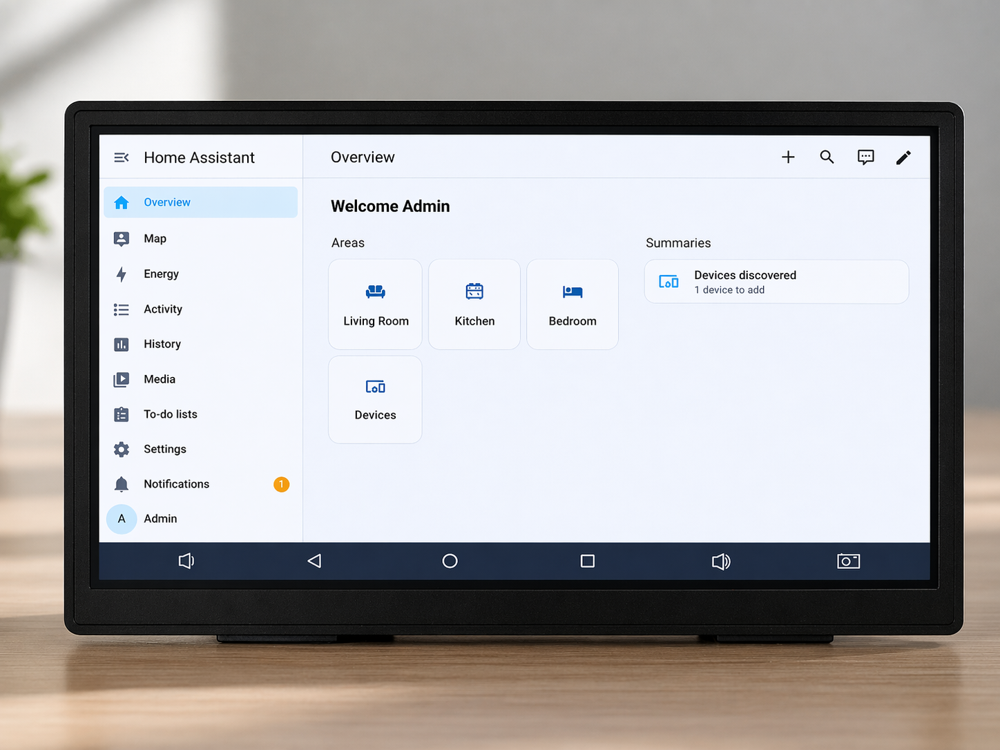
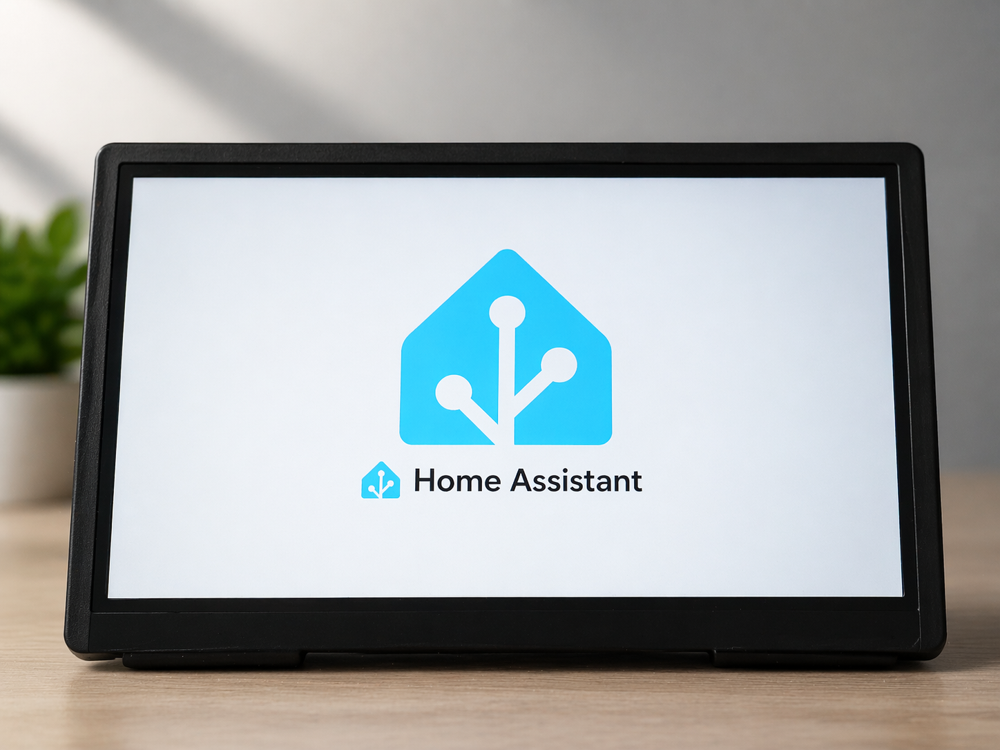
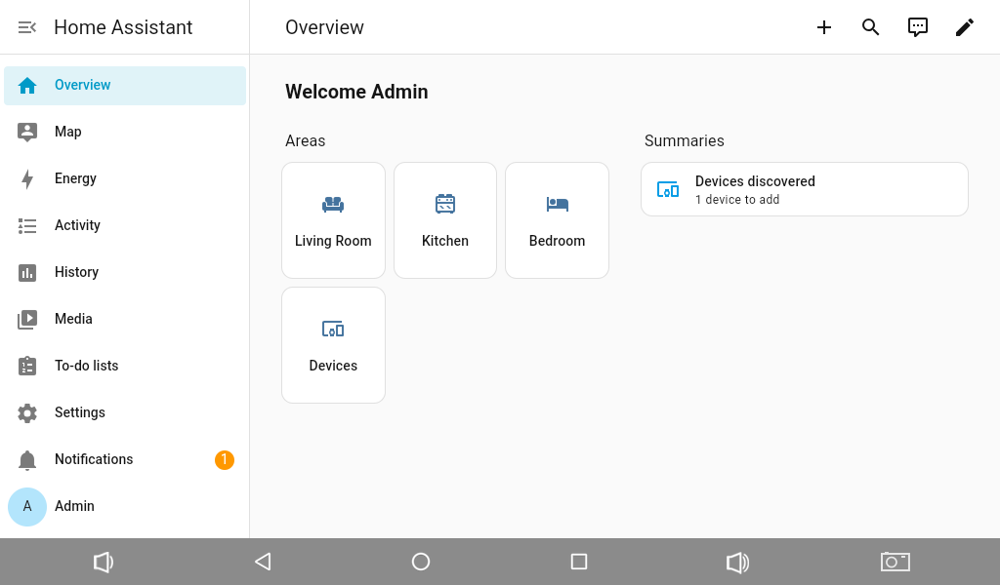
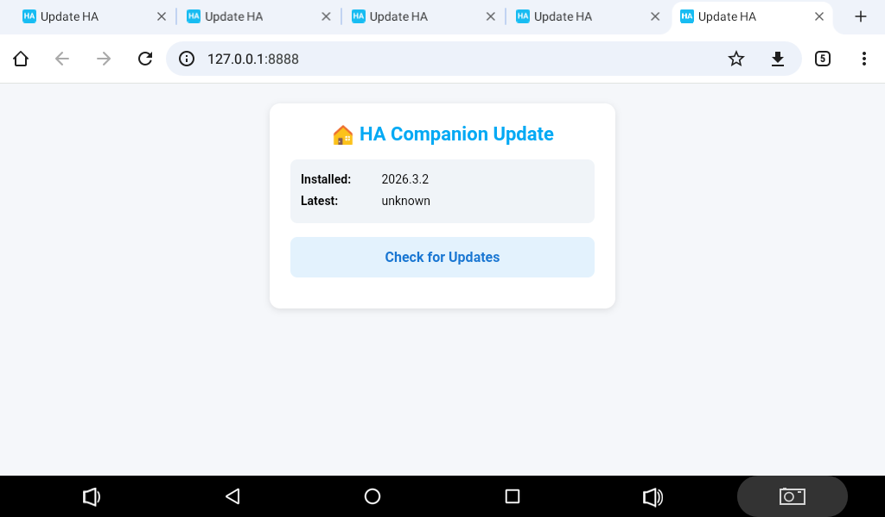
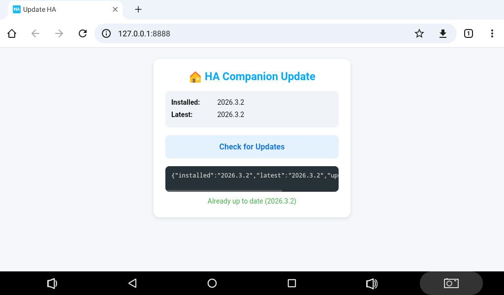

<p align="center">
  
</p>

<h1 align="center">7" Industrial Touch Panel — Home Assistant Ready</h1>

<p align="center">
  <b>Fanless · 24V DC / 5V USB Powered · Wall-Mountable · Built-in I/O</b><br>
  <i>Turn-key control panel for smart homes, industrial automation, and building management</i>
</p>

<p align="center">
  <a href="#key-features">Features</a> •
  <a href="#technical-specifications">Specs</a> •
  <a href="#io-and-connectivity">I/O</a> •
  <a href="#driver-support">Drivers</a> •
  <a href="#home-assistant-integration">HA Integration</a> •
  <a href="#mounting--installation">Mounting</a> •
  <a href="#gallery">Gallery</a>
</p>

---

## Overview

A ruggedized 7-inch industrial touch panel built around the **Rockchip RK3128** quad-core SoC, designed for permanent installation as a **Home Assistant dashboard**, HMI panel, or kiosk controller. Ships fully configured with Home Assistant Companion, optimized WebView, and ready to connect to your HA instance out of the box.

Unlike consumer tablets, this panel is engineered for **24/7 unattended operation**: passive cooling with no moving parts, wide-range DC power input, hardware serial ports for direct PLC/sensor communication, and four mounting screws for secure panel or wall installation.

---

## Key Features

| | Feature | Details |
|:---:|---|---|
| 🏭 | **Industrial Grade** | Designed for continuous 24/7 operation in workshops, server rooms, and production floors |
| ❄️ | **Passive Cooling** | Fully fanless, zero moving parts — silent and maintenance-free |
| ⚡ | **Dual Power Input** | 24V DC 2-pin connector (industrial standard) **or** 5V DC via Micro-USB |
| 🖥️ | **7" Multi-Touch Display** | 1024×600 IPS, 5-point capacitive touch, 160 DPI |
| 🏠 | **Home Assistant Ready** | Pre-installed HA Companion app, optimized browser, auto-start on boot |
| 🔌 | **Rich I/O** | 2× Serial ports, 2× GPIO pins, 2× USB Host, 2× USB OTG, speaker & mic connectors |
| 🔩 | **Panel Mountable** | 4× M3 mounting screws for wall or panel mounting |
| 📡 | **Wireless** | WiFi 802.11 b/g/n (2.4 GHz) |
| 🔧 | **Fully Hackable** | Rooted Android 7.1.2 with unlocked bootloader, full ADB access, custom kernel modules |

---

## Technical Specifications

### Processor & Memory

| Specification | Value |
|---|---|
| **SoC** | Rockchip RK3128 |
| **CPU** | Quad-core ARM Cortex-A7 @ 1.2 GHz |
| **GPU** | ARM Mali-400 MP (OpenGL ES 2.0) |
| **RAM** | 1 GB DDR3 |
| **Storage** | 8 GB eMMC (~3.6 GB available for user data) |

### Display

| Specification | Value |
|---|---|
| **Size** | 7 inches (diagonal) |
| **Resolution** | 1024 × 600 pixels |
| **Type** | IPS LCD |
| **Touch** | 5-point capacitive multi-touch |
| **Density** | 160 DPI |
| **Refresh Rate** | 57 Hz |
| **Brightness** | Software adjustable |

### Power Supply

| Specification | Value |
|---|---|
| **Primary Input** | **24V DC** via 2-pin connector (industrial standard) |
| **Alternative Input** | **5V DC** via Micro-USB connector |
| **Power Consumption** | < 5W typical |
| **Battery** | Internal Li-ion backup (maintains operation during power transitions) |
| **Operating Mode** | Continuous 24/7 operation |

### Physical

| Specification | Value |
|---|---|
| **Cooling** | Fully passive (fanless) — no moving parts |
| **Mounting** | 4× M3 screw holes for panel/wall mount |
| **Operating Temperature** | 0°C to +50°C |
| **Enclosure** | Rugged ABS/polycarbonate housing |

### Software

| Specification | Value |
|---|---|
| **OS** | Android 7.1.2 (Nougat) |
| **Build** | Rooted userdebug with full ADB access |
| **Kernel** | Linux 3.10.104 (with custom module support) |
| **WebView** | Chrome 119 (upgraded from AOSP default) |
| **Home Assistant** | Companion app pre-installed + auto-start on boot |

---

## I/O and Connectivity

### Port Diagram

```
┌────────────────────────────────────────────────────────────┐
│                        FRONT PANEL                         │
│                     7" Touch Display                       │
│                     1024 × 600 px                          │
│                                                            │
│  [ Front Camera ]                 [ Ambient Light Sensor ] │
└────────────────────────────────────────────────────────────┘

┌────────────────────────────────────────────────────────────┐
│                       SIDE / REAR I/O                      │
│                                                            │
│  ┌──────────────┐  ┌──────────────┐  ┌─────────────────┐  │
│  │  Micro-USB   │  │  USB OTG     │  │  2× USB Host    │  │
│  │  OTG + Power │  │  (4-pin hdr) │  │  (4-pin headers)│  │
│  └──────────────┘  └──────────────┘  └─────────────────┘  │
│                                                            │
│  ┌──────────────┐  ┌──────────────┐  ┌─────────────────┐  │
│  │  24V DC      │  │  Speaker     │  │  Microphone     │  │
│  │  (2-pin)     │  │  Header      │  │  Connector      │  │
│  └──────────────┘  └──────────────┘  └─────────────────┘  │
│                                                            │
│  ┌──────────────┐  ┌──────────────┐  ┌─────────────────┐  │
│  │  Serial Port │  │  Serial Port │  │  2× GPIO Pins   │  │
│  │  UART0 (TTL) │  │  UART1 (TTL) │  │  (3.3V logic)   │  │
│  └──────────────┘  └──────────────┘  └─────────────────┘  │
│                                                            │
│               [ 4× Mounting Screw Holes ]               │
└────────────────────────────────────────────────────────────┘
```

### Connector Summary

| Connector | Count | Description |
|---|:---:|---|
| **Micro-USB OTG** | 1 | USB On-The-Go port — doubles as 5V power input |
| **USB OTG (pin header)** | 1 | 4-pin connector for second USB OTG interface |
| **USB Host (pin header)** | 2 | 4-pin connectors for USB 2.0 host — connect peripherals, serial adapters, WiFi/BT dongles, LTE modems |
| **Serial Ports (UART)** | 2 | Hardware UART0 & UART1 — 3.3V TTL. Direct connection to PLCs, sensors, RS-485 converters |
| **GPIO Pins** | 2 | General Purpose I/O — 3.3V logic, controllable from userspace |
| **24V DC Input** | 1 | 2-pin power connector for 24V DC supply |
| **Speaker Connector** | 1 | Header for external 8Ω speakers — audio alerts and notifications |
| **Microphone Connector** | 1 | Pin header for external microphone — voice commands and audio monitoring |
| **MicroSD Slot** | 1 | Expandable storage (up to 64 GB) |

### Wireless

| Interface | Details |
|---|---|
| **WiFi** | 802.11 b/g/n — 2.4 GHz, up to 72 Mbps |
| **WiFi Direct** | Peer-to-peer connections supported |

### Sensors

| Sensor | Model | Use Case |
|---|---|---|
| **Accelerometer** | MMA8451Q | Screen auto-rotation, vibration detection |

---

## Driver Support

The tablet ships with **pre-compiled kernel modules** for a wide range of USB peripherals. All modules are cross-compiled for the RK3128 platform (Linux 3.10.104, ARMv7) and auto-loaded at boot.

### USB Serial Adapters

Plug-and-play support for all major USB-to-serial chipsets:

| Chipset | Module | Typical Use |
|---|---|---|
| **FTDI FT232 / FT2232** | `ftdi_sio.ko` | Industry-standard RS-232/RS-485 adapters |
| **CH340 / CH341** | `ch341.ko` | Low-cost serial adapters, Arduino boards |
| **CP2102 / CP2104** | `cp210x.ko` | Silicon Labs serial adapters |
| **PL2303** | `pl2303.ko` | Prolific serial adapters |

### USB WiFi Dongles

Extend or replace built-in WiFi:

| Chipset | Module |
|---|---|
| Realtek RTL8188EU | `8188eu.ko` |
| Realtek RTL8192CU | `8192cu.ko` |
| Realtek RTL8192DU | `8192du.ko` |
| Realtek RTL8723AU | `8723au.ko` |
| Realtek RTL8723BS | `8723bs.ko` |
| Realtek RTL8723BU | `8723bu.ko` |
| Realtek RTL8812AU | `8812au.ko` |
| Realtek RTL8188FU | `8188fu.ko` |
| Realtek RTL8822BU | `8822bu.ko` |

### USB Bluetooth Dongles

| Module | Supported Chipsets |
|---|---|
| `btusb.ko` | Generic USB Bluetooth (CSR, Intel, Broadcom, Realtek) |
| `ath3k.ko` | Atheros AR3011/AR3012 |
| `btbcm203x.ko` | Broadcom BCM203x |

### USB LTE / 3G / 5G Modems

Add cellular connectivity with USB modems:

| Module | Function |
|---|---|
| `option.ko` | Generic 3G/LTE serial (Huawei, ZTE, Sierra, Quectel) |
| `qmi_wwan.ko` | QMI data interface (Qualcomm-based modems) |
| `cdc_ether.ko` | CDC Ethernet (standard USB networking) |
| `cdc_ncm.ko` | CDC NCM (high-speed networking) |
| `cdc_mbim.ko` | CDC MBIM (mobile broadband) |
| `rndis_host.ko` | RNDIS networking |
| `sierra_net.ko` | Sierra Wireless modems |
| `cdc-acm.ko` | USB ACM AT command interface |
| `hso.ko` | Option HSO (legacy 3G) |

> **All modules are pre-installed.** Just plug in your USB device and it works.

---

## Home Assistant Integration

### What's Pre-Configured

Every panel ships ready to use:

- ✅ **Home Assistant Companion** app pre-installed and set as default launcher
- ✅ **Chrome 119 WebView** — modern web rendering (replaces outdated AOSP v52)
- ✅ **Auto-start on boot** — HA launches automatically, zero user interaction
- ✅ **Kiosk mode** — screen stays on, no sleep, navigation hidden
- ✅ **Auto-updater** — built-in OTA mechanism keeps HA Companion current
- ✅ **WiFi pre-configured** — connects to your network immediately

### Use Cases

| Application | How |
|---|---|
| **Smart Home Dashboard** | Wall-mount as always-on HA control panel |
| **HVAC Control** | Monitor heating/cooling, connect room sensors via serial |
| **Industrial HMI** | Serial ports for RS-485/Modbus communication with PLCs |
| **Access Control** | Front camera for presence detection, GPIO for door relay |
| **Energy Monitoring** | Real-time energy data, connect meters via serial |
| **3D Printer / CNC** | Serial to OctoPrint or CNC controller + camera feed |
| **Alarm Panel** | Speaker alerts, GPIO zone triggers, mic listen-in |
| **Meeting Room Display** | Room availability, calendar, environment data |

### Serial Port Integration

The two hardware UARTs appear as standard serial devices:

- **RS-485 converters** → Modbus RTU to industrial sensors and PLCs
- **TTL sensors** → CO2 sensors, air quality monitors, energy meters
- **Arduino / ESP** → direct wiring for custom I/O expansion
- **3D printers** → serial control via OctoPrint

### GPIO Integration

Two GPIO pins (3.3V logic) for:

- **Relay control** → lights, locks, valves
- **Digital input** → door sensors, buttons, limit switches
- **LED indicators** → visual status feedback

---

## Mounting & Installation

### Panel Mount

Four M3 threaded mounting holes on the rear panel:

- **Wall mount** — direct screw-in or DIN rail adapter

### Power Wiring

```
Option A — Industrial (recommended for cabinets)
┌──────────┐      ┌─────────┐      ┌──────────┐
│  24V DC  │─────▶│ 2-pin   │─────▶│  Tablet  │
│  PSU     │      │ connector│     │          │
└──────────┘      └─────────┘      └──────────┘
  Shares 24V rail with PLCs and sensors

Option B — USB Power (residential)
┌──────────┐      ┌─────────┐      ┌──────────┐
│  5V USB  │─────▶│ Micro   │─────▶│  Tablet  │
│  Adapter │      │ USB     │      │          │
└──────────┘      └─────────┘      └──────────┘
  Any quality 5V/2A charger
```

---

## Gallery

### Hardware

<p align="center">
  &nbsp;&nbsp;
  
</p>
<p align="center">
  &nbsp;&nbsp;
  
</p>
<p align="center">
  &nbsp;&nbsp;
  
</p>
<p align="center">
  &nbsp;&nbsp;
  
</p>
<p align="center">
  
</p>

### Screenshots

<p align="center">
  &nbsp;&nbsp;
  
</p>
<p align="center">
  
</p>

---

## Documentation

| Document | Description |
|---|---|
| [Technical Specifications](docs/SPECIFICATIONS.md) | Full hardware & software spec sheet |
| [Driver & Module Guide](docs/DRIVERS.md) | Supported USB peripherals and kernel modules |
| [Getting Started](docs/GETTING_STARTED.md) | Setup and configuration walkthrough |

---

## Customization

Need something beyond the standard configuration? We can provide:

- **Additional kernel drivers** — support for specific USB devices, sensors, or communication protocols
- **Custom Android apps** — tailored dashboards, kiosk launchers, or device management tools
- **Hardware modifications** — custom I/O configurations, branding, or enclosure options
- **Bulk provisioning** — pre-configured panels with your WiFi, HA server, and dashboard settings

Contact us to discuss your requirements.

---

## Support

- **Issues & Questions** — [GitHub Issues](https://github.com/plotter-doctor/industrial_tablet/issues)
- **Custom Orders & Development** — Open an issue or reach out via GitHub

---

<p align="center">
  <sub>Built for reliability. Designed for automation.</sub>
</p>
