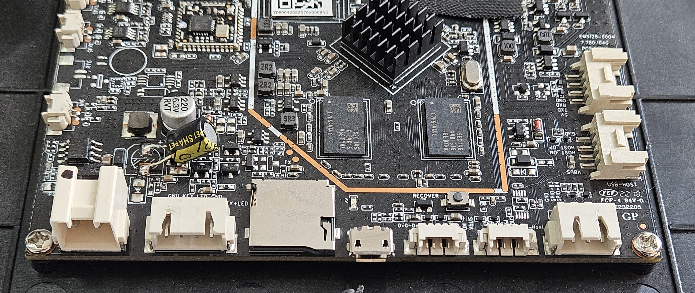

<p align="center">
  
</p>

<h1 align="center">7" Industrial Touch Panel — Arduino Workbench</h1>

<p align="center">
  <b>Fanless · 24V DC / 5V USB Powered · Workshop Ready · USB & Bluetooth Serial</b><br>
  <i>Dedicated companion panel for Arduino, ESP32, and electronics prototyping</i>
</p>

<p align="center">
  <a href="#key-features">Features</a> •
  <a href="#technical-specifications">Specs</a> •
  <a href="#io-and-connectivity">I/O</a> •
  <a href="#driver-support">Drivers</a> •
  <a href="#arduino--electronics-integration">Arduino</a> •
  <a href="#mounting--installation">Mounting</a> •
  <a href="#gallery">Gallery</a>
</p>

---

## Overview

A ruggedized 7-inch industrial touch panel built around the **Rockchip RK3128** quad-core SoC, configured as a dedicated **Arduino & electronics workbench companion**. Ships with RoboRemo, RemoteXY, serial terminals, and web shortcuts to Wokwi Simulator and Arduino Reference — ready to build, test, and control your projects out of the box.

Mount it on your bench as a dedicated serial monitor, use it as a wireless remote control for your Arduino projects via WiFi or Bluetooth, or run the Wokwi online simulator to prototype without hardware. USB serial drivers support CH341, FTDI, CP210x, and PL2303 — every common Arduino board connects directly.

---

## Key Features

| | Feature | Details |
|:---:|---|---|
| 🏭 | **Workshop Grade** | Designed for continuous operation on your electronics bench |
| ❄️ | **Passive Cooling** | Fully fanless, zero moving parts — no interference with sensitive measurements |
| ⚡ | **Dual Power Input** | 24V DC 2-pin connector **or** 5V DC via Micro-USB |
| 🖥️ | **7" Multi-Touch Display** | 1024×600 IPS, 5-point capacitive touch, 160 DPI |
| 🔌 | **USB Serial Built-in** | FTDI, CH341, CP210x, PL2303 drivers — direct serial link to any Arduino/ESP board |
| 📱 | **Wireless Remote** | RoboRemo + RemoteXY for WiFi/Bluetooth remote control UIs |
| 📟 | **Serial Terminals** | USB Serial Terminal + Bluetooth Serial Monitor pre-installed |
| 🌐 | **Web Tools** | Chrome shortcuts for Wokwi Simulator and Arduino Reference |
| 🔩 | **Panel Mountable** | 4× M3 mounting screws for bench or enclosure mounting |
| 🔧 | **Fully Hackable** | Rooted Android 7.1.2 with unlocked bootloader, full ADB access, custom kernel modules |

---

## Technical Specifications

### Processor & Memory

| Specification | Value |
|---|---|
| **SoC** | Rockchip RK3128 |
| **CPU** | Quad-core ARM Cortex-A7 @ 1.2 GHz |
| **GPU** | ARM Mali-400 MP (OpenGL ES 2.0) |
| **RAM** | 1 GB DDR3 |
| **Storage** | 8 GB eMMC (~3.6 GB available for user data) |

### Display

| Specification | Value |
|---|---|
| **Size** | 7 inches (diagonal) |
| **Resolution** | 1024 × 600 pixels |
| **Type** | IPS LCD |
| **Touch** | 5-point capacitive multi-touch |
| **Density** | 160 DPI |
| **Refresh Rate** | 57 Hz |
| **Brightness** | Software adjustable |

### Power Supply

| Specification | Value |
|---|---|
| **Primary Input** | **24V DC** via 2-pin connector |
| **Alternative Input** | **5V DC** via Micro-USB connector |
| **Power Consumption** | < 5W typical |
| **Battery** | Internal Li-ion backup (maintains operation during power transitions) |
| **Operating Mode** | Continuous 24/7 operation |

### Physical

| Specification | Value |
|---|---|
| **Cooling** | Fully passive (fanless) — no moving parts |
| **Mounting** | 4× screw holes for panel/enclosure mount |
| **Operating Temperature** | 0°C to +50°C |
| **Enclosure** | Rugged ABS/polycarbonate housing |

### Included Accessories

| Item | Description |
|---|---|
| **24V DC cable with connector** | Pre-wired cable with matching 2-pin connector |
| **Power button** | External power button for convenient on/off control |
| **WiFi antenna** | External WiFi antenna for improved signal reception |
| **Mounting screws** | 4× screws for bench/enclosure installation |

### Software

| Specification | Value |
|---|---|
| **OS** | Android 7.1.2 (Nougat) |
| **Build** | Rooted userdebug with full ADB access |
| **Kernel** | Linux 3.10.104 (with custom module support) |
| **WebView** | Chrome 119 (upgraded from AOSP default) |
| **RoboRemo** | Custom remote UI over WiFi/BT/USB — pre-installed |
| **RemoteXY** | Drag-and-drop Arduino GUI builder — pre-installed |
| **Serial USB Terminal** | USB serial monitor/debug — pre-installed |

---

## I/O and Connectivity

### Board Layout & Connectors

<p align="center">
  
</p>

| # | Connector | Description |
|:---:|---|---|
| 1 | **POWER** | 2-pin power input connector (24V DC) |
| 2 | **KEY + LED** | Key / LED harness connector |
| 3 | **microSD** | microSD card slot |
| 4 | **micro USB / OTG** | Service / OTG micro USB port (doubles as 5V power input) |
| 5 | **RECOVERY** | Recovery / flashing push button |
| 6 | **OTG header** | Small USB/OTG header: VBUS, D+, D−, GND |
| 7 | **USB header** | Second small USB-style header |
| 8 | **I/O / GPIO** | GPIO header: GPIO-B3, GPIO-B4, GND |
| 9 | **USB HOST** | USB host header |
| 10 | **UART** | Serial port: 5V, TXD, RXD, GND |
| 11 | **MIC** | Microphone connector |
| 12 | **RTC** | RTC pads / crystal area |
| 13 | **SPEAKER** | Speaker connectors |
| 14 | **SW-H/V** | Configuration slide switch |
| 15 | **ANT** | U.FL / IPEX antenna connector |
| 16 | **FPC LCD/TOUCH** | Flat-flex cables for display / touch |
| 17 | **Main SoC / heatsink** | Processor area with heatsink |

### Connector Summary

| Connector | Count | Description |
|---|:---:|---|
| **Micro-USB OTG** | 1 | USB On-The-Go port — doubles as 5V power input |
| **USB OTG (pin header)** | 1 | 4-pin connector for second USB OTG interface |
| **USB Host (pin header)** | 2 | 4-pin connectors for USB 2.0 host — connect Arduino boards, serial adapters |
| **Serial Port (UART)** | 1 | Hardware UART0 — 3.3V TTL. Direct serial link to Arduino, ESP, or any MCU |
| **GPIO Pins** | 2 | General Purpose I/O — 3.3V logic, controllable from userspace |
| **24V DC Input** | 1 | 2-pin power connector for 24V DC supply |
| **Speaker Connector** | 1 | Header for external speaker — notification alerts |
| **Microphone Connector** | 1 | Pin header for external microphone |
| **MicroSD Slot** | 1 | Expandable storage (up to 64 GB) — project files and data logs |

### Wireless

| Interface | Details |
|---|---|
| **WiFi** | 802.11 b/g/n — 2.4 GHz, up to 72 Mbps |
| **WiFi Direct** | Peer-to-peer connections supported |

### Sensors

| Sensor | Model | Use Case |
|---|---|---|
| **Accelerometer** | MMA8451Q | Screen auto-rotation |

---

## Driver Support

The tablet ships with **pre-compiled kernel modules** for a wide range of USB peripherals. All modules are cross-compiled for the RK3128 platform (Linux 3.10.104, ARMv7) and auto-loaded at boot.

### USB Serial Adapters

Plug-and-play support for all major USB-to-serial chipsets — connect any Arduino or ESP board directly:

| Chipset | Module | Typical Use |
|---|---|---|
| **FTDI FT232 / FT2232** | `ftdi_sio.ko` | Industrial serial adapters, FTDI-based boards |
| **CH340 / CH341** | `ch341.ko` | Arduino Uno/Nano/Mega, most clone boards, NodeMCU |
| **CP2102 / CP2104** | `cp210x.ko` | ESP32-DevKit, NodeMCU CP2102, Pololu boards |
| **PL2303** | `pl2303.ko` | Legacy serial adapters |

### USB WiFi Dongles

Extend or replace built-in WiFi:

| Chipset | Module |
|---|---|
| Realtek RTL8188EU | `8188eu.ko` |
| Realtek RTL8192CU | `8192cu.ko` |
| Realtek RTL8192DU | `8192du.ko` |
| Realtek RTL8723AU | `8723au.ko` |
| Realtek RTL8723BS | `8723bs.ko` |
| Realtek RTL8723BU | `8723bu.ko` |
| Realtek RTL8812AU | `8812au.ko` |
| Realtek RTL8188FU | `8188fu.ko` |
| Realtek RTL8822BU | `8822bu.ko` |

### USB Bluetooth Dongles

| Module | Supported Chipsets |
|---|---|
| `btusb.ko` | Generic USB Bluetooth (CSR, Intel, Broadcom, Realtek) |
| `ath3k.ko` | Atheros AR3011/AR3012 |
| `btbcm203x.ko` | Broadcom BCM203x |

> **All modules are pre-installed.** Just plug in your USB device and it works.

---

## Arduino & Electronics Integration

### Pre-Installed Apps

Every panel ships ready for Arduino development and control:

| App | Package | Purpose |
|---|---|---|
| **RoboRemo Free** | `com.hardcodedjoy.roboremofree` | Custom remote UI over WiFi/BT/USB — build control panels with buttons, joysticks, sliders |
| **RemoteXY Free** | `com.shevauto.remotexy.free` | Drag-and-drop Arduino GUI builder — design phone/tablet UIs that pair with Arduino sketches |
| **BT Serial Monitor** | `com.giumig.apps.bluetoothserialmonitor` | Bluetooth serial console — monitor HC-05/HC-06/BLE modules |
| **Serial USB Terminal** | `de.kai_morich.serial_usb_terminal` | Full-featured USB serial terminal — monitor, send commands, log data |
| **Wokwi Simulator** | Chrome shortcut | Online Arduino/ESP32 simulator with serial monitor |
| **Arduino Reference** | Chrome shortcut | Official Arduino language and library reference |

### What's Pre-Configured

- ✅ **Auto-start on boot** — your preferred app launches automatically
- ✅ **Chrome 119 WebView** — modern web for Wokwi simulator and online tools
- ✅ **USB serial drivers** — CH341, FTDI, CP210x, PL2303 for every Arduino board
- ✅ **Bluetooth dongle drivers** — CSR, Broadcom, Atheros for BT serial modules
- ✅ **Kiosk mode** — screen stays on, no sleep, navigation hidden
- ✅ **WiFi pre-configured** — connects to your workshop network immediately
- ✅ **Bloatware removed** — maximum RAM available for your apps

### Use Cases

| Application | How |
|---|---|
| **USB Serial Monitor** | Plug Arduino via USB → Serial USB Terminal shows serial output in real-time |
| **Bluetooth Remote** | Pair with HC-05/HC-06 → BT Serial Monitor sends/receives serial data wirelessly |
| **WiFi Remote Control** | RoboRemo connects to ESP8266/ESP32 over WiFi — custom dashboards with joysticks, buttons |
| **Arduino GUI Builder** | RemoteXY generates Arduino sketch code that pairs with your custom tablet UI |
| **Online Simulator** | Wokwi Chrome shortcut — simulate Arduino/ESP projects with virtual serial monitor |
| **Reference Docs** | Arduino Reference shortcut — quick lookup of functions, libraries, syntax |
| **Data Logger** | Serial USB Terminal logs incoming serial data to file on MicroSD |
| **GPIO Testing** | Use tablet's 2× GPIO pins for digital I/O testing alongside your Arduino project |
| **Bench Display** | Mount on workbench as a dedicated serial monitor / project dashboard |

### Connecting Your Arduino

#### USB Connection (Most Common)

1. Plug your Arduino board into a USB Host pin header (use a USB-A to USB-B/micro cable with adapter)
2. The CH341/FTDI/CP210x driver loads automatically — device appears as `/dev/ttyUSB0`
3. Open Serial USB Terminal → select `/dev/ttyUSB0` → set baud rate (usually 9600 or 115200)
4. You're connected — serial data flows in real-time

#### Bluetooth Connection

1. Plug a USB Bluetooth dongle into a USB Host pin header
2. Pair with your HC-05/HC-06/BLE module from Android Bluetooth settings
3. Open BT Serial Monitor → select your paired device
4. Wireless serial communication — perfect for mobile robot projects

#### Direct UART (3.3V TTL)

1. Wire UART0 (`/dev/ttyS0`) directly to your board's serial pins
2. Connect: Tablet TX → Board RX, Tablet RX → Board TX, GND → GND
3. **Important:** Signals are 3.3V TTL — matches most 3.3V Arduino/ESP boards directly

---

## Mounting & Installation

### Workbench Mount

Four M3 threaded mounting holes on the rear panel:

- **Bench mount** — screw to a small stand or bracket on your workbench
- **Shelf mount** — attach to a shelf above your electronics workspace
- **Wall mount** — direct screw-in near your bench area

### Power Wiring

```
Option A — Bench PSU
┌──────────┐      ┌─────────┐      ┌──────────┐
│  24V DC  │─────▶│ 2-pin   │─────▶│  Tablet  │
│  PSU     │      │ connector│      │          │
└──────────┘      └─────────┘      └──────────┘
  Your bench power supply

Option B — USB Power (simplest)
┌──────────┐      ┌─────────┐      ┌──────────┐
│  5V USB  │─────▶│ Micro   │─────▶│  Tablet  │
│  Adapter │      │ USB     │      │          │
└──────────┘      └─────────┘      └──────────┘
  Any quality 5V/2A charger
```

---

## Gallery

### Hardware

<p align="center">
  &nbsp;&nbsp;
  
</p>
<p align="center">
  &nbsp;&nbsp;
  
</p>
<p align="center">
  &nbsp;&nbsp;
  
</p>
<p align="center">
  &nbsp;&nbsp;
  
</p>

---

## Documentation

| Document | Description |
|---|---|
| [Technical Specifications](docs/SPECIFICATIONS.md) | Full hardware & software spec sheet |
| [Driver & Module Guide](docs/DRIVERS.md) | Supported USB peripherals and kernel modules |
| [Getting Started](docs/GETTING_STARTED.md) | Setup and configuration walkthrough |

---

## Customization

Need something beyond the standard configuration? We can provide:

- **Additional kernel drivers** — support for specific USB devices or communication protocols
- **Custom remote UIs** — tailored dashboards for your specific Arduino/ESP project
- **Hardware modifications** — custom I/O configurations, branding, or enclosure options
- **Bulk provisioning** — pre-configured panels with your WiFi, app settings, and auto-start

Contact us to discuss your requirements.

---

## Support

- **Issues & Questions** — [GitHub Issues](https://github.com/plotter-doctor/industrial_tablet/issues)
- **Custom Orders & Development** — Open an issue or reach out via GitHub

---

<p align="center">
  <sub>Built for the workbench. Designed for makers.</sub>
</p>
