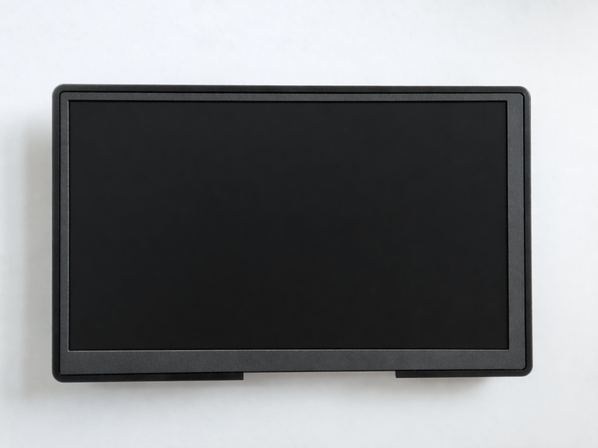

<p align="center">
  
</p>

<h1 align="center">7" Industrial Touch Panel — GRBL CNC Controller</h1>

<p align="center">
  <b>Fanless · 24V DC / 5V USB Powered · Workshop Ready · USB Serial + TCP Bridge</b><br>
  <i>Dedicated control panel for GRBL and grblHAL CNC machines, routers, and laser cutters</i>
</p>

<p align="center">
  <a href="#key-features">Features</a> •
  <a href="#technical-specifications">Specs</a> •
  <a href="#io-and-connectivity">I/O</a> •
  <a href="#driver-support">Drivers</a> •
  <a href="#cnc--grbl-integration">CNC / GRBL</a> •
  <a href="#mounting--installation">Mounting</a> •
  <a href="#gallery">Gallery</a>
</p>

---

## Overview

A ruggedized 7-inch industrial touch panel built around the **Rockchip RK3128** quad-core SoC, configured as a dedicated **GRBL CNC controller**. Ships with GRBL Controller app, Serial USB Terminal, and a built-in TCP-to-serial bridge — ready to jog, home, and run G-code on your CNC router, laser cutter, or engraver out of the box.

The built-in **ser2net bridge** exposes your USB serial adapter as a TCP socket on `127.0.0.1:8023`, letting web-based G-code senders in Chrome talk to your GRBL controller board — no WebSerial API needed. Chrome shortcuts for the Grbl Controller web UI and jscut CAM (SVG → G-code) are pre-installed.

---

## Key Features

| | Feature | Details |
|:---:|---|---|
| 🏭 | **Workshop Grade** | Designed for continuous operation next to CNC machines, routers, laser cutters |
| ❄️ | **Passive Cooling** | Fully fanless, zero moving parts — no dust ingestion in workshop environments |
| ⚡ | **Dual Power Input** | 24V DC 2-pin connector (share your CNC PSU) **or** 5V DC via Micro-USB |
| 🖥️ | **7" Multi-Touch Display** | 1024×600 IPS, 5-point capacitive touch, 160 DPI |
| 🔩 | **GRBL Ready** | Pre-installed GRBL Controller app with USB serial support |
| 🔌 | **USB Serial Built-in** | FTDI, CH341, CP210x, PL2303 drivers — direct connection to GRBL controller boards |
| 🌐 | **TCP-to-Serial Bridge** | ser2net daemon exposes `/dev/ttyUSB0` as TCP `127.0.0.1:8023` for web-based senders |
| 🗺️ | **CAM Tools** | Chrome shortcut for jscut — SVG to G-code toolpath generation in the browser |
| 🔩 | **Panel Mountable** | 4× M3 mounting screws for machine enclosure or wall mounting |
| 🔧 | **Fully Hackable** | Rooted Android 7.1.2 with unlocked bootloader, full ADB access, custom kernel modules |

---

## Technical Specifications

### Processor & Memory

| Specification | Value |
|---|---|
| **SoC** | Rockchip RK3128 |
| **CPU** | Quad-core ARM Cortex-A7 @ 1.2 GHz |
| **GPU** | ARM Mali-400 MP (OpenGL ES 2.0) |
| **RAM** | 1 GB DDR3 |
| **Storage** | 8 GB eMMC (~3.6 GB available for user data) |

### Display

| Specification | Value |
|---|---|
| **Size** | 7 inches (diagonal) |
| **Resolution** | 1024 × 600 pixels |
| **Type** | IPS LCD |
| **Touch** | 5-point capacitive multi-touch |
| **Density** | 160 DPI |
| **Refresh Rate** | 57 Hz |
| **Brightness** | Software adjustable |

### Power Supply

| Specification | Value |
|---|---|
| **Primary Input** | **24V DC** via 2-pin connector (share your CNC machine's PSU) |
| **Alternative Input** | **5V DC** via Micro-USB connector |
| **Power Consumption** | < 5W typical |
| **Battery** | Internal Li-ion backup (maintains operation during power transitions) |
| **Operating Mode** | Continuous 24/7 operation |

### Physical

| Specification | Value |
|---|---|
| **Cooling** | Fully passive (fanless) — no moving parts, no dust ingestion |
| **Mounting** | 4× screw holes for panel/enclosure mount |
| **Operating Temperature** | 0°C to +50°C |
| **Enclosure** | Rugged ABS/polycarbonate housing |

### Included Accessories

| Item | Description |
|---|---|
| **24V DC cable with connector** | Pre-wired cable with matching 2-pin connector, ready to connect to your CNC PSU |
| **Power button** | External power button for convenient on/off control |
| **WiFi antenna** | External WiFi antenna for improved signal reception |
| **Mounting screws** | 4× screws for machine enclosure/wall installation |

### Software

| Specification | Value |
|---|---|
| **OS** | Android 7.1.2 (Nougat) |
| **Build** | Rooted userdebug with full ADB access |
| **Kernel** | Linux 3.10.104 (with custom module support) |
| **WebView** | Chrome 119 (upgraded from AOSP default) |
| **GRBL Controller** | Full-featured GRBL sender via USB serial — pre-installed |
| **Serial USB Terminal** | Raw serial monitor/debug — pre-installed |
| **ser2net Bridge** | TCP-to-serial daemon on port 8023 — pre-configured |

---

## I/O and Connectivity

### Board Layout & Connectors

<p align="center">
  
</p>

| # | Connector | Description |
|:---:|---|---|
| 1 | **POWER** | 2-pin power input connector (24V DC) |
| 2 | **KEY + LED** | Key / LED harness connector |
| 3 | **microSD** | microSD card slot |
| 4 | **micro USB / OTG** | Service / OTG micro USB port (doubles as 5V power input) |
| 5 | **RECOVERY** | Recovery / flashing push button |
| 6 | **OTG header** | Small USB/OTG header: VBUS, D+, D−, GND |
| 7 | **USB header** | Second small USB-style header |
| 8 | **I/O / GPIO** | GPIO header: GPIO-B3, GPIO-B4, GND |
| 9 | **USB HOST** | USB host header |
| 10 | **UART** | Serial port: 5V, TXD, RXD, GND |
| 11 | **MIC** | Microphone connector |
| 12 | **RTC** | RTC pads / crystal area |
| 13 | **SPEAKER** | Speaker connectors |
| 14 | **SW-H/V** | Configuration slide switch |
| 15 | **ANT** | U.FL / IPEX antenna connector |
| 16 | **FPC LCD/TOUCH** | Flat-flex cables for display / touch |
| 17 | **Main SoC / heatsink** | Processor area with heatsink |

### Connector Summary

| Connector | Count | Description |
|---|:---:|---|
| **Micro-USB OTG** | 1 | USB On-The-Go port — doubles as 5V power input |
| **USB OTG (pin header)** | 1 | 4-pin connector for second USB OTG interface |
| **USB Host (pin header)** | 2 | 4-pin connectors for USB 2.0 host — connect GRBL controller boards, serial adapters |
| **Serial Port (UART)** | 1 | Hardware UART0 — 3.3V TTL. Direct connection to GRBL/grblHAL boards |
| **GPIO Pins** | 2 | General Purpose I/O — 3.3V logic, controllable from userspace |
| **24V DC Input** | 1 | 2-pin power connector for 24V DC supply |
| **Speaker Connector** | 1 | Header for external speaker — job completion alerts |
| **Microphone Connector** | 1 | Pin header for external microphone |
| **MicroSD Slot** | 1 | Expandable storage (up to 64 GB) — G-code file storage |

### Wireless

| Interface | Details |
|---|---|
| **WiFi** | 802.11 b/g/n — 2.4 GHz, up to 72 Mbps |
| **WiFi Direct** | Peer-to-peer connections supported |

### Sensors

| Sensor | Model | Use Case |
|---|---|---|
| **Accelerometer** | MMA8451Q | Screen auto-rotation |

---

## Driver Support

The tablet ships with **pre-compiled kernel modules** for a wide range of USB peripherals. All modules are cross-compiled for the RK3128 platform (Linux 3.10.104, ARMv7) and auto-loaded at boot.

### USB Serial Adapters

Plug-and-play support for all major USB-to-serial chipsets — essential for GRBL communication:

| Chipset | Module | Typical Use |
|---|---|---|
| **FTDI FT232 / FT2232** | `ftdi_sio.ko` | Industrial serial adapters, CNC controller boards |
| **CH340 / CH341** | `ch341.ko` | Arduino-based GRBL boards, CNC shields |
| **CP2102 / CP2104** | `cp210x.ko` | grblHAL boards, Teensy, premium CNC controllers |
| **PL2303** | `pl2303.ko` | Legacy serial adapters |

### USB WiFi Dongles

Extend or replace built-in WiFi:

| Chipset | Module |
|---|---|
| Realtek RTL8188EU | `8188eu.ko` |
| Realtek RTL8192CU | `8192cu.ko` |
| Realtek RTL8192DU | `8192du.ko` |
| Realtek RTL8723AU | `8723au.ko` |
| Realtek RTL8723BS | `8723bs.ko` |
| Realtek RTL8723BU | `8723bu.ko` |
| Realtek RTL8812AU | `8812au.ko` |
| Realtek RTL8188FU | `8188fu.ko` |
| Realtek RTL8822BU | `8822bu.ko` |

### USB Bluetooth Dongles

| Module | Supported Chipsets |
|---|---|
| `btusb.ko` | Generic USB Bluetooth (CSR, Intel, Broadcom, Realtek) |
| `ath3k.ko` | Atheros AR3011/AR3012 |
| `btbcm203x.ko` | Broadcom BCM203x |

> **All modules are pre-installed.** Just plug in your USB device and it works.

---

## CNC / GRBL Integration

### Pre-Installed Apps

Every panel ships ready for CNC machine control:

| App | Package | Purpose |
|---|---|---|
| **GRBL Controller** | `in.co.gorest.grblcontroller` | Full-featured GRBL sender — jog, home, run G-code via USB serial |
| **Serial USB Terminal** | `de.kai_morich.serial_usb_terminal` | Raw serial monitor for GRBL commands and debugging |
| **Grbl Controller Web** | Chrome shortcut | Web-based GRBL sender (connects via TCP bridge) |
| **jscut CAM** | Chrome shortcut | Browser-based CAM — SVG to G-code toolpath generator |

### TCP-to-Serial Bridge (ser2net)

A lightweight daemon runs on boot, exposing your USB serial adapter as a TCP socket:

| Parameter | Value |
|---|---|
| **Listen Address** | `127.0.0.1:8023` |
| **Serial Device** | `/dev/ttyUSB0` |
| **Baud Rate** | 115200 (GRBL 1.1+ / grblHAL default) |
| **Protocol** | Raw TCP ↔ Serial passthrough |

This lets web-based G-code senders in Chrome communicate with your GRBL board without WebSerial API support (which Chrome on Android 7 doesn't have). The Grbl Controller Web shortcut connects to `127.0.0.1:8023` automatically.

### What's Pre-Configured

- ✅ **Auto-start on boot** — GRBL Controller app launches automatically
- ✅ **ser2net bridge** — TCP port 8023 bridges to `/dev/ttyUSB0` at 115200 baud
- ✅ **Chrome 119 WebView** — modern web for Grbl Controller Web and jscut CAM
- ✅ **USB serial drivers** — FTDI, CH341, CP210x, PL2303 for all GRBL boards
- ✅ **Kiosk mode** — screen stays on, no sleep, navigation hidden
- ✅ **WiFi pre-configured** — connects to your workshop network immediately
- ✅ **Bloatware removed** — maximum RAM available for CNC apps

### Use Cases

| Application | How |
|---|---|
| **CNC Router Control** | GRBL Controller → USB serial → GRBL board: jog, home, zero, run G-code |
| **Laser Cutter Control** | Same as CNC — GRBL Controller supports laser mode (`$32=1`) |
| **Engraver Control** | Lightweight GRBL jobs via the native app or web interface |
| **Web-Based Sender** | Chrome → Grbl Controller Web → TCP:8023 → ser2net → USB serial → GRBL |
| **G-code from SVG** | Open jscut in Chrome → import SVG → generate toolpaths → save G-code |
| **Serial Debug** | Serial USB Terminal for raw GRBL commands (`$$`, `$H`, `$X`, `G0 X10`) |
| **Remote Monitoring** | WiFi access to the tablet via ADB or VNC for remote job status |
| **Job Completion Alert** | Speaker output for audible notification when G-code job finishes |

### Connecting Your GRBL Board

#### USB Serial Adapter (Recommended)

1. Plug a USB-to-serial adapter into a USB Host pin header
   - **CH341** adapters: most Arduino-based GRBL shields (CNC Shield v3, etc.)
   - **FTDI FT232** adapters: industrial-grade, widest compatibility
   - **CP210x** adapters: grblHAL, Teensy-based controllers
2. Connect the adapter to your GRBL board's USB or serial port
3. The driver loads automatically — device appears as `/dev/ttyUSB0`
4. ser2net bridge activates, GRBL Controller connects automatically

#### Direct UART (3.3V TTL)

1. Wire UART0 (`/dev/ttyS0`) directly to your GRBL board's serial pins
2. Connect: Tablet TX → Board RX, Tablet RX → Board TX, GND → GND
3. **Important:** Signals are 3.3V TTL — use a level shifter if your board requires 5V

### GRBL Quick Reference

Common GRBL commands you can send from the Serial USB Terminal:

| Command | Action |
|---|---|
| `$$` | View GRBL settings |
| `$H` | Home all axes |
| `$X` | Kill alarm lock |
| `G0 X10 Y10` | Rapid move to X10 Y10 |
| `G1 X50 F500` | Linear move to X50 at 500 mm/min |
| `?` | Current status (position, state) |
| `!` | Feed hold (pause) |
| `~` | Cycle start (resume) |
| `Ctrl+X` | Soft reset |

---

## Mounting & Installation

### CNC Machine Mount

Four M3 threaded mounting holes on the rear panel:

- **Machine enclosure** — screw directly to your CNC enclosure panel
- **Gantry mount** — attach to a bracket on your CNC frame
- **Wall mount** — near your CNC station for easy access
- **Desk mount** — small stand beside your machine

### Power Wiring

```
Option A — Shared PSU (recommended)
┌──────────┐      ┌─────────┐      ┌──────────┐
│  24V DC  │─────▶│ 2-pin   │─────▶│  Tablet  │
│  PSU     │      │ connector│      │          │
└──────────┘      └─────────┘      └──────────┘
  Same 24V PSU as your CNC machine

Option B — USB Power
┌──────────┐      ┌─────────┐      ┌──────────┐
│  5V USB  │─────▶│ Micro   │─────▶│  Tablet  │
│  Adapter │      │ USB     │      │          │
└──────────┘      └─────────┘      └──────────┘
  Any quality 5V/2A charger
```

---

## Gallery

### Hardware

<p align="center">
  &nbsp;&nbsp;
  
</p>
<p align="center">
  &nbsp;&nbsp;
  
</p>
<p align="center">
  &nbsp;&nbsp;
  
</p>
<p align="center">
  &nbsp;&nbsp;
  
</p>

---

## Documentation

| Document | Description |
|---|---|
| [Technical Specifications](docs/SPECIFICATIONS.md) | Full hardware & software spec sheet |
| [Driver & Module Guide](docs/DRIVERS.md) | Supported USB peripherals and kernel modules |
| [Getting Started](docs/GETTING_STARTED.md) | Setup and configuration walkthrough |

---

## Customization

Need something beyond the standard configuration? We can provide:

- **Additional kernel drivers** — support for specific USB devices or communication protocols
- **Custom G-code sender UI** — tailored interface for your specific CNC machine
- **Hardware modifications** — custom I/O configurations, branding, or enclosure options
- **Bulk provisioning** — pre-configured panels with your WiFi, GRBL settings, and machine parameters

Contact us to discuss your requirements.

---

## Support

- **Issues & Questions** — [GitHub Issues](https://github.com/plotter-doctor/industrial_tablet/issues)
- **Custom Orders & Development** — Open an issue or reach out via GitHub

---

<p align="center">
  <sub>Built for the workshop. Designed for CNC.</sub>
</p>
