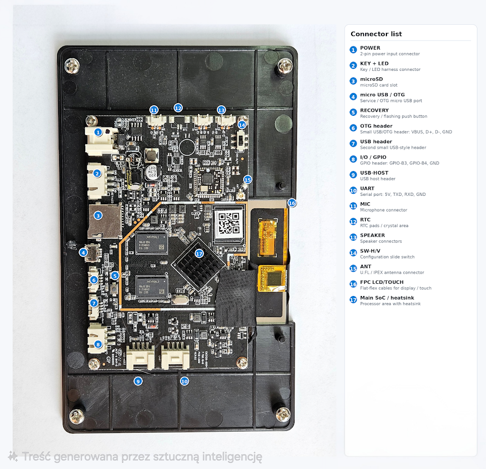
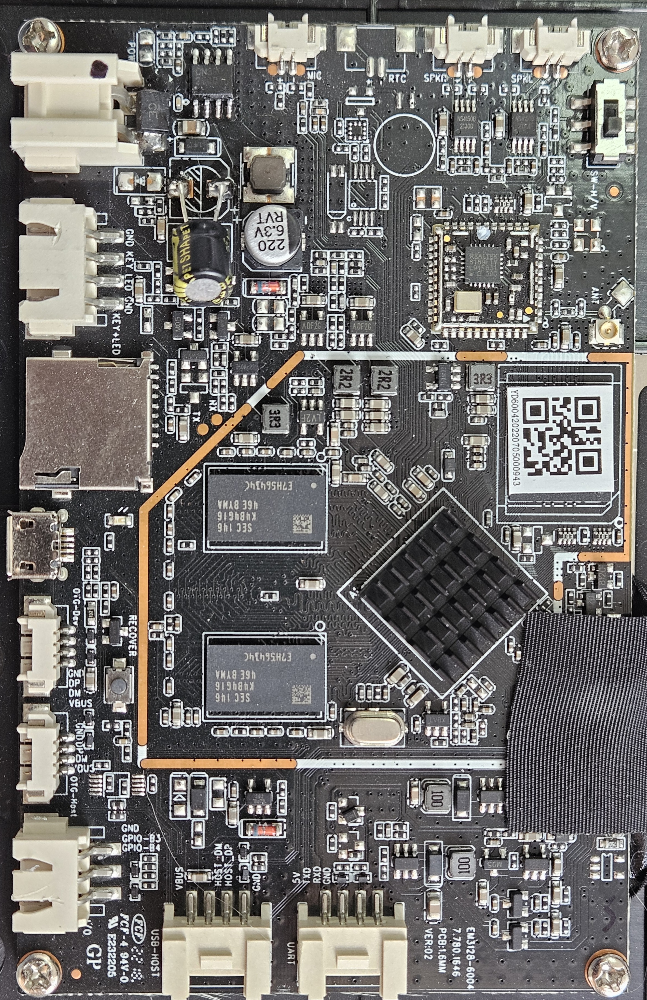

<p align="center">
  
</p>

<h1 align="center">7" Industrial Touch Panel — HMI Pro</h1>

<p align="center">
  <b>Fanless · 24V DC / 5V USB Powered · Panel Mountable · Modbus & MQTT Ready</b><br>
  <i>Compact HMI panel for PLC monitoring, SCADA dashboards, and industrial automation</i>
</p>

<p align="center">
  <a href="#key-features">Features</a> •
  <a href="#technical-specifications">Specs</a> •
  <a href="#io-and-connectivity">I/O</a> •
  <a href="#driver-support">Drivers</a> •
  <a href="#hmi--scada-integration">HMI / SCADA</a> •
  <a href="#mounting--installation">Mounting</a> •
  <a href="#gallery">Gallery</a>
</p>

---

## Overview

A ruggedized 7-inch industrial touch panel built around the **Rockchip RK3128** quad-core SoC, configured as a dedicated **HMI / SCADA panel**. Ships with Virtuino 6, TeslaModbusSCADA, TeslaMultiSCADA, and five more industrial apps pre-installed — ready to monitor PLCs, Modbus devices, and MQTT brokers out of the box.

Unlike generic tablets, this panel is engineered for **24/7 industrial operation**: passive cooling that handles cabinet environments, 24V DC power from the same DIN rail supply as your PLCs, USB serial drivers for Modbus RTU adapters, and four mounting screws for permanent panel installation.

---

## Key Features

| | Feature | Details |
|:---:|---|---|
| 🏭 | **Industrial Grade** | Designed for continuous 24/7 operation in control cabinets and factory floors |
| ❄️ | **Passive Cooling** | Fully fanless, zero moving parts — reliable in enclosed cabinets |
| ⚡ | **Dual Power Input** | 24V DC 2-pin connector (share your DIN rail PSU) **or** 5V DC via Micro-USB |
| 🖥️ | **7" Multi-Touch Display** | 1024×600 IPS, 5-point capacitive touch, 160 DPI |
| 📊 | **HMI Ready** | Pre-installed Virtuino 6, TeslaModbusSCADA, TeslaMultiSCADA, HMI Control Panel, Remote HMI |
| 🔌 | **Modbus RTU** | USB Serial drivers (FTDI, CH341, CP210x) for RS-485/RS-232 Modbus RTU adapters |
| 📡 | **MQTT / IoT** | Virtuino IoT + Virtuino MQTT for cloud and local MQTT broker dashboards |
| 🔩 | **Panel Mountable** | 4× M3 mounting screws for enclosure or cabinet panel mounting |
| 🌐 | **Web Dashboards** | Chrome shortcuts for Node-RED and Grafana web UIs |
| 🔧 | **Fully Hackable** | Rooted Android 7.1.2 with unlocked bootloader, full ADB access, custom kernel modules |

---

## Technical Specifications

### Processor & Memory

| Specification | Value |
|---|---|
| **SoC** | Rockchip RK3128 |
| **CPU** | Quad-core ARM Cortex-A7 @ 1.2 GHz |
| **GPU** | ARM Mali-400 MP (OpenGL ES 2.0) |
| **RAM** | 1 GB DDR3 |
| **Storage** | 8 GB eMMC (~3.6 GB available for user data) |

### Display

| Specification | Value |
|---|---|
| **Size** | 7 inches (diagonal) |
| **Resolution** | 1024 × 600 pixels |
| **Type** | IPS LCD |
| **Touch** | 5-point capacitive multi-touch |
| **Density** | 160 DPI |
| **Refresh Rate** | 57 Hz |
| **Brightness** | Software adjustable |

### Power Supply

| Specification | Value |
|---|---|
| **Primary Input** | **24V DC** via 2-pin connector (share your DIN rail PSU) |
| **Alternative Input** | **5V DC** via Micro-USB connector |
| **Power Consumption** | < 5W typical |
| **Battery** | Internal Li-ion backup (maintains operation during power transitions) |
| **Operating Mode** | Continuous 24/7 operation |

### Physical

| Specification | Value |
|---|---|
| **Cooling** | Fully passive (fanless) — no moving parts |
| **Mounting** | 4× screw holes for panel/enclosure mount |
| **Operating Temperature** | 0°C to +50°C |
| **Enclosure** | Rugged ABS/polycarbonate housing |

### Included Accessories

| Item | Description |
|---|---|
| **24V DC cable with connector** | Pre-wired cable with matching 2-pin connector, ready to connect to your DIN rail PSU |
| **Power button** | External power button for convenient on/off control |
| **WiFi antenna** | External WiFi antenna for improved signal reception |
| **Mounting screws** | 4× screws for panel/cabinet installation |

### Software

| Specification | Value |
|---|---|
| **OS** | Android 7.1.2 (Nougat) |
| **Build** | Rooted userdebug with full ADB access |
| **Kernel** | Linux 3.10.104 (with custom module support) |
| **WebView** | Chrome 119 (upgraded from AOSP default) |
| **Virtuino 6** | Drag-and-drop IoT/PLC dashboard builder — pre-installed |
| **TeslaModbusSCADA** | Modbus TCP/RTU SCADA client — pre-installed |
| **TeslaMultiSCADA** | Multi-protocol SCADA client — pre-installed |

---

## I/O and Connectivity

### Board Layout & Connectors

<p align="center">
  
</p>

| # | Connector | Description |
|:---:|---|---|
| 1 | **POWER** | 2-pin power input connector (24V DC) |
| 2 | **KEY + LED** | Key / LED harness connector |
| 3 | **microSD** | microSD card slot |
| 4 | **micro USB / OTG** | Service / OTG micro USB port (doubles as 5V power input) |
| 5 | **RECOVERY** | Recovery / flashing push button |
| 6 | **OTG header** | Small USB/OTG header: VBUS, D+, D−, GND |
| 7 | **USB header** | Second small USB-style header |
| 8 | **I/O / GPIO** | GPIO header: GPIO-B3, GPIO-B4, GND |
| 9 | **USB HOST** | USB host header |
| 10 | **UART** | Serial port: 5V, TXD, RXD, GND |
| 11 | **MIC** | Microphone connector |
| 12 | **RTC** | RTC pads / crystal area |
| 13 | **SPEAKER** | Speaker connectors |
| 14 | **SW-H/V** | Configuration slide switch |
| 15 | **ANT** | U.FL / IPEX antenna connector |
| 16 | **FPC LCD/TOUCH** | Flat-flex cables for display / touch |
| 17 | **Main SoC / heatsink** | Processor area with heatsink |

### Connector Summary

| Connector | Count | Description |
|---|:---:|---|
| **Micro-USB OTG** | 1 | USB On-The-Go port — doubles as 5V power input |
| **USB OTG (pin header)** | 1 | 4-pin connector for second USB OTG interface |
| **USB Host (pin header)** | 2 | 4-pin connectors for USB 2.0 host — connect Modbus adapters, WiFi dongles |
| **Serial Port (UART)** | 1 | Hardware UART0 — 3.3V TTL. Direct RS-232/485 connection with level shifter |
| **GPIO Pins** | 2 | General Purpose I/O — 3.3V logic, controllable from userspace |
| **24V DC Input** | 1 | 2-pin power connector for 24V DC supply |
| **Speaker Connector** | 1 | Header for external speaker — alarm notifications |
| **Microphone Connector** | 1 | Pin header for external microphone |
| **MicroSD Slot** | 1 | Expandable storage (up to 64 GB) — data logging |

### Wireless

| Interface | Details |
|---|---|
| **WiFi** | 802.11 b/g/n — 2.4 GHz, up to 72 Mbps |
| **WiFi Direct** | Peer-to-peer connections supported |

### Sensors

| Sensor | Model | Use Case |
|---|---|---|
| **Accelerometer** | MMA8451Q | Screen auto-rotation |

---

## Driver Support

The tablet ships with **pre-compiled kernel modules** for a wide range of USB peripherals. All modules are cross-compiled for the RK3128 platform (Linux 3.10.104, ARMv7) and auto-loaded at boot.

### USB Serial Adapters

Plug-and-play support for all major USB-to-serial chipsets — essential for Modbus RTU communication:

| Chipset | Module | Typical Use |
|---|---|---|
| **FTDI FT232 / FT2232** | `ftdi_sio.ko` | Industrial RS-485/RS-232 Modbus adapters |
| **CH340 / CH341** | `ch341.ko` | Budget USB-to-serial converters |
| **CP2102 / CP2104** | `cp210x.ko` | Silicon Labs industrial adapters |
| **PL2303** | `pl2303.ko` | Legacy serial adapters |

### USB WiFi Dongles

Extend or replace built-in WiFi:

| Chipset | Module |
|---|---|
| Realtek RTL8188EU | `8188eu.ko` |
| Realtek RTL8192CU | `8192cu.ko` |
| Realtek RTL8192DU | `8192du.ko` |
| Realtek RTL8723AU | `8723au.ko` |
| Realtek RTL8723BS | `8723bs.ko` |
| Realtek RTL8723BU | `8723bu.ko` |
| Realtek RTL8812AU | `8812au.ko` |
| Realtek RTL8188FU | `8188fu.ko` |
| Realtek RTL8822BU | `8822bu.ko` |

### USB Bluetooth Dongles

| Module | Supported Chipsets |
|---|---|
| `btusb.ko` | Generic USB Bluetooth (CSR, Intel, Broadcom, Realtek) |
| `ath3k.ko` | Atheros AR3011/AR3012 |
| `btbcm203x.ko` | Broadcom BCM203x |

> **All modules are pre-installed.** Just plug in your USB device and it works.

---

## HMI / SCADA Integration

### Pre-Installed Apps

Every panel ships ready for industrial monitoring and control:

| App | Package | Purpose |
|---|---|---|
| **Virtuino 6** | `com.virtuino_automations.virtuino` | Drag-and-drop IoT/PLC dashboard builder with gauges, charts, switches |
| **Virtuino IoT** | `com.virtuino.virtuino_iot` | Cloud/MQTT IoT dashboard with remote monitoring |
| **Virtuino MQTT** | `com.virtuino.virtuino_mqtt` | MQTT-focused HMI panel for local/cloud brokers |
| **TeslaModbusSCADA** | `modbus.tesla.scada` | Modbus TCP/RTU SCADA client with real-time visualization |
| **TeslaMultiSCADA** | `multiprotocol.tesla.scada` | Multi-protocol SCADA client (Modbus, MQTT, HTTP) |
| **HMI Control Panel** | `com.casdata.hmicontrolpanel` | HMI dashboard with gauges, switches, and indicators |
| **Remote HMI** | `com.automationdirect.remotehmi` | AutomationDirect PLC remote viewer |
| **Node-RED** | Chrome shortcut | Flow-based automation editor (when served locally) |
| **Grafana** | Chrome shortcut | Metrics/time-series dashboard (when served locally) |

### What's Pre-Configured

- ✅ **Auto-start on boot** — your HMI dashboard launches automatically
- ✅ **Chrome 119 WebView** — modern web rendering for Node-RED, Grafana, and web-based SCADA
- ✅ **USB serial drivers** — FTDI, CH341, CP210x, PL2303 for Modbus RTU adapters
- ✅ **Kiosk mode** — screen stays on, no sleep, navigation hidden
- ✅ **WiFi pre-configured** — connects to your plant network immediately
- ✅ **Bloatware removed** — maximum RAM available for HMI apps

### Use Cases

| Application | How |
|---|---|
| **Modbus RTU Dashboard** | USB RS-485 adapter → TeslaModbusSCADA reads holding/input registers from PLCs |
| **Modbus TCP Monitor** | WiFi → TeslaModbusSCADA or TeslaMultiSCADA connects to Modbus TCP devices |
| **MQTT Dashboard** | Virtuino MQTT subscribes to topics from your MQTT broker (Mosquitto, HiveMQ) |
| **Node-RED Flows** | Chrome shortcut to Node-RED running on a local gateway (Raspberry Pi, edge PC) |
| **Grafana Panels** | Chrome shortcut to Grafana for time-series data from InfluxDB/Prometheus |
| **PLC Remote View** | Remote HMI connects to AutomationDirect PLC panels |
| **IoT Sensor Display** | Virtuino IoT cloud dashboard for remote sensor monitoring |
| **Custom HMI Screens** | Virtuino 6 drag-and-drop editor — build custom panels with gauges, LEDs, sliders |
| **Alarm Panel** | Speaker output for audible alerts, GPIO for indicator lights |

### Modbus RTU Connection

#### USB RS-485/RS-232 Adapter

1. Plug a USB-to-serial adapter (FTDI or CH341 recommended) into a USB Host pin header
2. Connect the adapter to your RS-485 bus or PLC serial port
3. The driver loads automatically — device appears as `/dev/ttyUSB0`
4. Configure TeslaModbusSCADA: set serial port, baud rate, and slave address

#### Direct UART (3.3V TTL)

1. Wire UART0 (`/dev/ttyS0`) directly to your device's serial pins
2. Connect: Tablet TX → Device RX, Tablet RX → Device TX, GND → GND
3. **Important:** Signals are 3.3V TTL — use a level shifter for RS-232 or RS-485

---

## Mounting & Installation

### Control Cabinet Mount

Four M3 threaded mounting holes on the rear panel:

- **Cabinet door mount** — screw directly to your control cabinet door panel
- **DIN rail adapter** — use a VESA-to-DIN-rail bracket
- **Enclosure mount** — attach to an IP-rated enclosure near your equipment
- **Wall mount** — direct screw-in near your process equipment

### Power Wiring

```
Option A — DIN Rail PSU (recommended)
┌──────────┐      ┌─────────┐      ┌──────────┐
│  24V DC  │─────▶│ 2-pin   │─────▶│  Tablet  │
│  PSU     │      │ connector│      │          │
└──────────┘      └─────────┘      └──────────┘
  Same 24V PSU as your PLC / DIN rail supply

Option B — USB Power
┌──────────┐      ┌─────────┐      ┌──────────┐
│  5V USB  │─────▶│ Micro   │─────▶│  Tablet  │
│  Adapter │      │ USB     │      │          │
└──────────┘      └─────────┘      └──────────┘
  Any quality 5V/2A charger
```

---

## Gallery

### Hardware

<p align="center">
  &nbsp;&nbsp;
  
</p>
<p align="center">
  &nbsp;&nbsp;
  
</p>
<p align="center">
  &nbsp;&nbsp;
  
</p>
<p align="center">
  &nbsp;&nbsp;
  
</p>

---

## Documentation

| Document | Description |
|---|---|
| [Technical Specifications](docs/SPECIFICATIONS.md) | Full hardware & software spec sheet |
| [Driver & Module Guide](docs/DRIVERS.md) | Supported USB peripherals and kernel modules |
| [Getting Started](docs/GETTING_STARTED.md) | Setup and configuration walkthrough |

---

## Customization

Need something beyond the standard configuration? We can provide:

- **Additional kernel drivers** — support for specific USB devices or communication protocols
- **Custom SCADA screens** — tailored dashboards for your specific process or equipment
- **Hardware modifications** — custom I/O configurations, branding, or enclosure options
- **Bulk provisioning** — pre-configured panels with your WiFi, PLC addresses, and dashboard settings

Contact us to discuss your requirements.

---

## Support

- **Issues & Questions** — [GitHub Issues](https://github.com/plotter-doctor/industrial_tablet/issues)
- **Custom Orders & Development** — Open an issue or reach out via GitHub

---

<p align="center">
  <sub>Built for the factory floor. Designed for automation.</sub>
</p>
