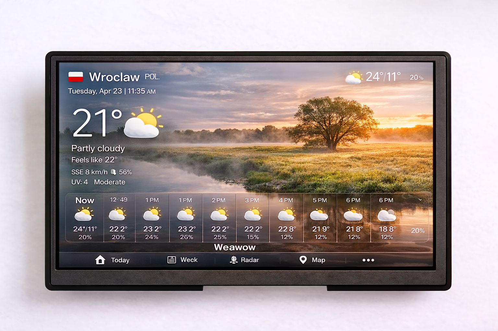

<p align="center">
  
</p>

<h1 align="center">7" Industrial Touch Panel — Weather & Calendar Dashboard</h1>

<p align="center">
  <b>Fanless · 24V DC / 5V USB Powered · Wall-Mountable · Always-On Display</b><br>
  <i>Dedicated weather station and calendar dashboard for homes, offices, and lobbies</i>
</p>

<p align="center">
  <a href="#key-features">Features</a> •
  <a href="#technical-specifications">Specs</a> •
  <a href="#io-and-connectivity">I/O</a> •
  <a href="#weather--calendar-integration">Apps</a> •
  <a href="#mounting--installation">Mounting</a> •
  <a href="#gallery">Gallery</a>
</p>

---

## Overview

A ruggedized 7-inch industrial touch panel built around the **Rockchip RK3128** quad-core SoC, configured as a dedicated **weather and calendar dashboard**. Ships with Weawow, Pearl Weather, Etar Calendar, and Tasks.org pre-installed — a beautiful always-on information display ready to mount on any wall.

Unlike consumer tablets that go to sleep and nag for updates, this panel is engineered for **24/7 always-on display**: passive cooling with no moving parts, wide-range DC power input, screen that never turns off, and four mounting screws for permanent wall installation. Set it and forget it.

---

## Key Features

| | Feature | Details |
|:---:|---|---|
| 🌤️ | **Weather Dashboard** | Weawow + Pearl Weather — beautiful forecasts, radar, and weather widgets |
| 📅 | **Calendar & Tasks** | Etar Calendar + Tasks.org — appointments, reminders, and task planning |
| ❄️ | **Passive Cooling** | Fully fanless, zero moving parts — silent and maintenance-free |
| ⚡ | **Dual Power Input** | 24V DC 2-pin connector (industrial standard) **or** 5V DC via Micro-USB |
| 🖥️ | **7" Always-On Display** | 1024×600 IPS, 5-point capacitive touch, 160 DPI |
| 🔅 | **Maximum Brightness** | Pre-configured for dashboard visibility from across the room |
| 🔩 | **Wall Mountable** | 4× M3 mounting screws for permanent wall installation |
| 📡 | **WiFi Connected** | 802.11 b/g/n (2.4 GHz) — automatic weather data updates |
| 🔧 | **Fully Hackable** | Rooted Android 7.1.2 with unlocked bootloader, full ADB access |

---

## Technical Specifications

### Processor & Memory

| Specification | Value |
|---|---|
| **SoC** | Rockchip RK3128 |
| **CPU** | Quad-core ARM Cortex-A7 @ 1.2 GHz |
| **GPU** | ARM Mali-400 MP (OpenGL ES 2.0) |
| **RAM** | 1 GB DDR3 |
| **Storage** | 8 GB eMMC (~3.6 GB available for user data) |

### Display

| Specification | Value |
|---|---|
| **Size** | 7 inches (diagonal) |
| **Resolution** | 1024 × 600 pixels |
| **Type** | IPS LCD |
| **Touch** | 5-point capacitive multi-touch |
| **Density** | 160 DPI |
| **Refresh Rate** | 57 Hz |
| **Brightness** | Maximum (pre-configured for dashboard visibility) |

### Power Supply

| Specification | Value |
|---|---|
| **Primary Input** | **24V DC** via 2-pin connector |
| **Alternative Input** | **5V DC** via Micro-USB connector |
| **Power Consumption** | < 5W typical |
| **Battery** | Internal Li-ion backup (maintains operation during power transitions) |
| **Operating Mode** | Continuous 24/7 always-on display |

### Physical

| Specification | Value |
|---|---|
| **Cooling** | Fully passive (fanless) — no moving parts |
| **Mounting** | 4× screw holes for wall mount |
| **Operating Temperature** | 0°C to +50°C |
| **Enclosure** | Rugged ABS/polycarbonate housing |

### Included Accessories

| Item | Description |
|---|---|
| **24V DC cable with connector** | Pre-wired cable with matching 2-pin connector, ready to connect to your PSU |
| **Power button** | External power button for convenient on/off control |
| **WiFi antenna** | External WiFi antenna for improved signal reception |
| **Mounting screws** | 4× screws for wall installation |

### Software

| Specification | Value |
|---|---|
| **OS** | Android 7.1.2 (Nougat) |
| **Build** | Rooted userdebug with full ADB access |
| **Kernel** | Linux 3.10.104 (with custom module support) |
| **WebView** | Chrome 119 (upgraded from AOSP default) |
| **Weawow** | Weather dashboard — pre-installed (primary) |
| **Pearl Weather** | Weather widget — pre-installed (alternative) |
| **Etar Calendar** | Calendar app — pre-installed |
| **Tasks.org** | Task planner — pre-installed |

---

## I/O and Connectivity

### Board Layout & Connectors

<p align="center">
  
</p>

| # | Connector | Description |
|:---:|---|---|
| 1 | **POWER** | 2-pin power input connector (24V DC) |
| 2 | **KEY + LED** | Key / LED harness connector |
| 3 | **microSD** | microSD card slot |
| 4 | **micro USB / OTG** | Service / OTG micro USB port (doubles as 5V power input) |
| 5 | **RECOVERY** | Recovery / flashing push button |
| 6 | **OTG header** | Small USB/OTG header: VBUS, D+, D−, GND |
| 7 | **USB header** | Second small USB-style header |
| 8 | **I/O / GPIO** | GPIO header: GPIO-B3, GPIO-B4, GND |
| 9 | **USB HOST** | USB host header |
| 10 | **UART** | Serial port: 5V, TXD, RXD, GND |
| 11 | **MIC** | Microphone connector |
| 12 | **RTC** | RTC pads / crystal area |
| 13 | **SPEAKER** | Speaker connectors |
| 14 | **SW-H/V** | Configuration slide switch |
| 15 | **ANT** | U.FL / IPEX antenna connector |
| 16 | **FPC LCD/TOUCH** | Flat-flex cables for display / touch |
| 17 | **Main SoC / heatsink** | Processor area with heatsink |

### Connector Summary

| Connector | Count | Description |
|---|:---:|---|
| **Micro-USB OTG** | 1 | USB On-The-Go port — doubles as 5V power input |
| **USB OTG (pin header)** | 1 | 4-pin connector for second USB OTG interface |
| **USB Host (pin header)** | 2 | 4-pin connectors for USB 2.0 host — connect WiFi dongles, keyboards |
| **Serial Port (UART)** | 1 | Hardware UART0 — 3.3V TTL |
| **GPIO Pins** | 2 | General Purpose I/O — 3.3V logic |
| **24V DC Input** | 1 | 2-pin power connector for 24V DC supply |
| **Speaker Connector** | 1 | Header for external speaker — weather alerts and notification sounds |
| **Microphone Connector** | 1 | Pin header for external microphone |
| **MicroSD Slot** | 1 | Expandable storage (up to 64 GB) |

### Wireless

| Interface | Details |
|---|---|
| **WiFi** | 802.11 b/g/n — 2.4 GHz, up to 72 Mbps |
| **WiFi Direct** | Peer-to-peer connections supported |

### Sensors

| Sensor | Model | Use Case |
|---|---|---|
| **Accelerometer** | MMA8451Q | Screen auto-rotation |

---

## Weather & Calendar Integration

### Pre-Installed Apps

Every panel ships ready as an information dashboard:

| App | Package | Purpose |
|---|---|---|
| **Weawow** | `com.weawow` | Beautiful weather dashboard with photos, forecasts, radar, hourly/daily detail |
| **Pearl Weather** | `com.macropinch.pearl` | Elegant weather widget with animated backgrounds |
| **Etar Calendar** | `ws.xsoh.etar` | Open-source calendar with CalDAV sync support |
| **Tasks.org** | `org.tasks` | Task planner with lists, due dates, and reminders |

### What's Pre-Configured

- ✅ **Weawow auto-start on boot** — weather dashboard launches automatically
- ✅ **Maximum brightness** — screen set to full brightness for dashboard visibility
- ✅ **Auto timezone** — time zone synced automatically via network
- ✅ **Calendar permissions** — Etar pre-granted calendar read/write access
- ✅ **Kiosk mode** — screen stays on 24/7, no sleep, no interruptions
- ✅ **WiFi pre-configured** — connects and updates weather data immediately
- ✅ **Bloatware removed** — maximum RAM for smooth dashboard performance

### Use Cases

| Application | How |
|---|---|
| **Home Weather Display** | Wall-mount in kitchen, hallway, or living room as an always-on weather dashboard |
| **Office Lobby Board** | Display weather, calendar, and company schedule on a reception desk or wall |
| **Meeting Room Display** | Show room availability, weather, and upcoming meetings |
| **Family Command Center** | Central calendar + tasks + weather for household coordination |
| **Guest Room Info Panel** | Hotel/Airbnb room info with local weather and events |
| **Workshop Dashboard** | Quick weather check before outdoor work, calendar for job scheduling |
| **Elderly-Friendly Display** | Large weather display with easy-to-read temperatures and forecasts |

### Calendar Sync

Etar Calendar supports CalDAV sync for integration with:

- **Google Calendar** — via CalDAV adapter
- **Nextcloud** — direct CalDAV connection
- **iCloud** — via CalDAV protocol
- **Microsoft Exchange** — via compatible CalDAV bridge
- **Any CalDAV server** — standards-compliant sync

---

## Mounting & Installation

### Wall Mount

Four M3 threaded mounting holes on the rear panel:

1. Choose a wall location at eye height with good visibility
2. Mark four screw positions using the tablet's mounting holes as a template
3. Drill pilot holes and insert wall anchors (for drywall) or drill directly (for wood/metal)
4. Secure the tablet using the 4× M3 screws
5. Route the power cable through the wall or use a surface-mount cable channel

### Desk Stand

Use any tablet stand or 3D-printed bracket with M3 holes for a desk or shelf placement.

### Power Wiring

```
Option A — Industrial (for commercial installations)
┌──────────┐      ┌─────────┐      ┌──────────┐
│  24V DC  │─────▶│ 2-pin   │─────▶│  Tablet  │
│  PSU     │      │ connector│      │          │
└──────────┘      └─────────┘      └──────────┘
  Clean installation behind the wall

Option B — USB Power (residential)
┌──────────┐      ┌─────────┐      ┌──────────┐
│  5V USB  │─────▶│ Micro   │─────▶│  Tablet  │
│  Adapter │      │ USB     │      │          │
└──────────┘      └─────────┘      └──────────┘
  Any quality 5V/2A charger
```

---

## Gallery

### Hardware

<p align="center">
  &nbsp;&nbsp;
  
</p>
<p align="center">
  &nbsp;&nbsp;
  
</p>
<p align="center">
  &nbsp;&nbsp;
  
</p>
<p align="center">
  &nbsp;&nbsp;
  
</p>

---

## Documentation

| Document | Description |
|---|---|
| [Technical Specifications](docs/SPECIFICATIONS.md) | Full hardware & software spec sheet |
| [Getting Started](docs/GETTING_STARTED.md) | Setup and configuration walkthrough |

---

## Customization

Need something beyond the standard configuration? We can provide:

- **Custom weather widgets** — tailored dashboard layouts for your specific needs
- **Additional apps** — news feeds, smart home widgets, digital signage
- **Hardware modifications** — custom branding, enclosure options, power configurations
- **Bulk provisioning** — pre-configured panels with your WiFi, calendar accounts, and dashboard settings

Contact us to discuss your requirements.

---

## Support

- **Issues & Questions** — [GitHub Issues](https://github.com/plotter-doctor/industrial_tablet/issues)
- **Custom Orders & Development** — Open an issue or reach out via GitHub

---

<p align="center">
  <sub>Always on. Always informed.</sub>
</p>
